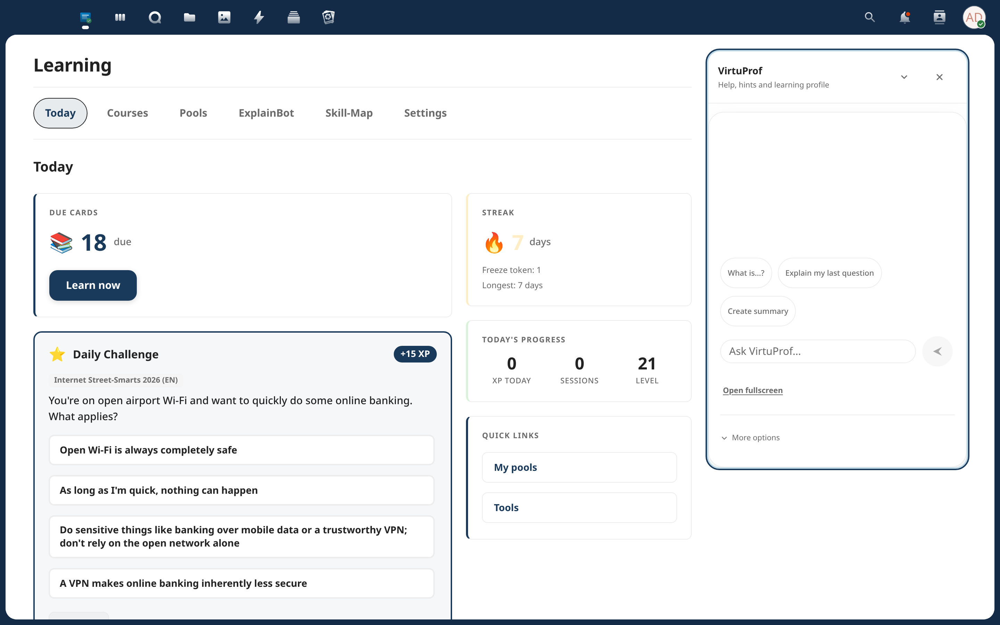
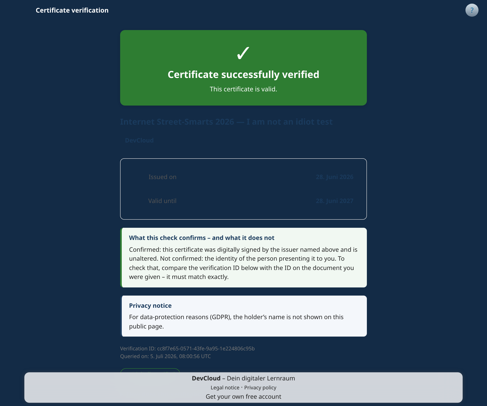
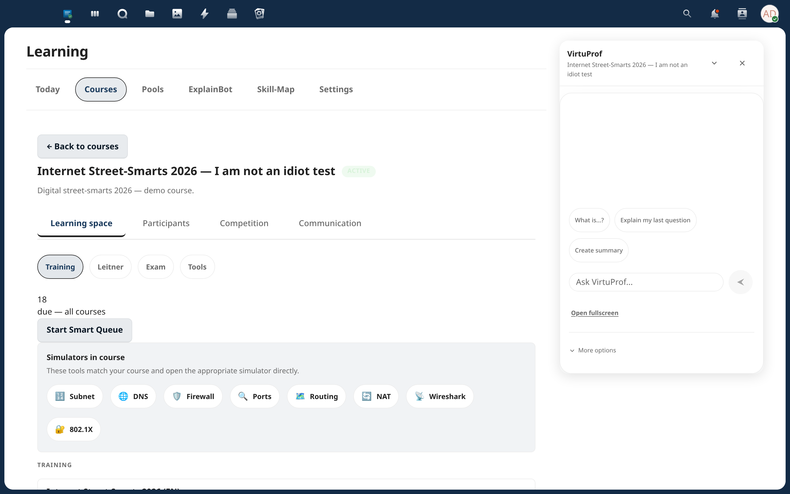

# Learning — Nextcloud App

A self-hosted learning platform for Nextcloud. Flashcards with spaced repetition, interactive IT simulators, AI tutor, and instructor analytics. Your data never leaves your server.


Built for IT certification bootcamps (CompTIA, Cisco, AWS) but works for any subject — from vocabulary drilling to exam preparation. When a learner passes, the app issues a **cryptographically signed, publicly verifiable completion certificate** — turning any course into a real credential.

> **Looking for pilot partners!** If you run Nextcloud at a school, university, training provider, or public institution — I'd love your feedback. Demo accounts available. [Open an issue](https://codeberg.org/andremadstop/learning-nc/issues) or email me.



## Features

### Learning Modes
- **Smart Queue** — one-click review of all due cards, sorted by memory strength (FSRS-5)
- **Leitner System** — classic 5-box spaced repetition with automatic scheduling
- **Training Mode** — quick quiz sessions with immediate feedback and confidence buttons
- **Exam Simulator** — timed exams with configurable presets, passing thresholds, and scaled scoring
- **Story Campaigns** — learn through real IT incident scenarios (WannaCry, SolarWinds, Log4Shell)

### Certification & Compliance
- **Signed completion certificates** — every passing learner automatically receives a cryptographically signed (Ed25519) certificate
- **Public verification portal** — anyone can confirm a certificate's authenticity from its permanent URL, no login required
- **Compliance reports** — organization-wide completion overview for audits and works agreements
- **Mandatory training & recertification** — assign required courses, track certificate expiry, and automate recertification reminders
- **Tamper-proof audit trail** — every issuance, revocation, and completion is logged



### Interactive Simulators (9)
- CLI Terminal, Subnet Calculator, DNS Resolver, Firewall Builder
- Port Scanner, Routing Table, NAT Table, Wireshark Lite, Network Topology Placement



### Multiplayer & Gamification
- **Live Duels** — real-time 1v1 quiz battles via Server-Sent Events
- **Sprint & Elimination** — 2-5 player gameshow modes
- **Seasonal League** — weekly competition with promotion/relegation
- XP, levels, streaks, 10 badges

### For Instructors
- Course management with pool assignment and student enrollment
- **At-risk detection** — automatic warnings for struggling students
- **Chapter heatmaps** — see where the class struggles at a glance
- **Curriculum timeline** — plan course schedule with milestones
- **Admin dashboard** — CSV export, course archiving, cohort merging
- Collaborative knowledge base with student contributions and moderation

### Post-Course Retention
- **Maintenance Mode** — automated long-term review schedule after course ends
- **Trouble-spot cheat sheet** — export your weakest topics for targeted exam prep

### AI Features (optional)
Requires a Google Gemini API key. Without it, the app is fully functional — AI features are simply hidden. Each user must explicitly opt in (GDPR-compliant consent flow).

- **VirtuProf** — AI learning assistant with RAG-powered answers and source citations
- **Question Generator** — create flashcards from pasted text
- **Note Generator** — AI-powered topic summaries saved to Nextcloud Files

### Question Types
- Multiple Choice (single & multi-select)
- Free Text with fuzzy matching
- Performance-Based Questions (PBQ) — interactive CLI, drag-and-drop, wiring tasks
- CSV/JSON import & export, pool sharing, multi-language translations

## Installation

### From Nextcloud App Store (Recommended)

1. Go to **Apps** in your Nextcloud admin panel
2. Search for **"Learning"**
3. Click **Download and enable**

[View on App Store](https://apps.nextcloud.com/apps/learning)

### Manual Installation

```bash
# The Nextcloud app lives in the repo's app/ subdirectory — clone outside, then copy app/ in.
git clone https://codeberg.org/andremadstop/learning-nc.git /tmp/learning-nc
cd /tmp/learning-nc/app && npm install && npm run build
cp -r /tmp/learning-nc/app /path/to/nextcloud/custom_apps/learning
php /path/to/nextcloud/occ app:enable learning
```

### Certificates setup (one-time)

Signed completion certificates (v5.0.0+) require an issuer signing key. Generate it once
per server — without it, courses can be configured for certification but no certificate is
minted when a learner passes:

```bash
php /path/to/nextcloud/occ learning:cert:init-issuer
```

The admin settings page shows a reminder until the key exists. Rotate later with
`occ learning:cert:init-issuer --rotate` (retired keys keep verifying past certificates).

## Privacy & Data Protection

**No data leaves your server** unless AI features are explicitly enabled by an admin AND the user has given consent.

### When AI is enabled (optional)

| Data sent to Gemini API | Details |
|---|---|
| Question text | Up to 500 characters, stripped of HTML |
| Pool sample questions | Up to 15 questions (text only, truncated) |
| Course name | Name only — no enrollment data |
| Leitner box counts | Numeric distribution only |

**Never sent:** usernames, emails, passwords, server paths, personal data.

### Admin controls
- Global AI toggle in admin settings
- Per-user consent required before first interaction
- Rate limiting: 10 req/min, 100 req/day per user
- Full audit log of all AI requests

When AI is enabled, data is processed by Google Gemini API. For GDPR compliance, review Google's [Data Processing Addendum](https://cloud.google.com/terms/data-processing-addendum).

### Cert lifecycle & compliance (v5.2.0)

**Verify-URL permanence & retention.** Every issued certificate gets a public verify URL. This
URL is *permanent only within the data-retention window*: after `retention_years` (app config,
default **3** — this default is flagged for confirmation with your data-protection officer /
works agreement; statutory duties such as ArbSchG/AGG evidence may require a longer window),
the record is crypto-erased (recipient identity removed, signed credential scrubbed, tombstone
set). From then on the verify URL returns a defined **"record no longer available"** state —
never an error page. Only superseded, closed, or revoked certificates age out; a user's current
active certificate is exempt until it is replaced.

**Works-council prerequisite (Germany).** Recertification reminders and compliance monitoring
are technical monitoring features in the sense of **BetrVG §87 Abs. 1 Nr. 6**. Organizations
with a works council must conclude a **Betriebsvereinbarung** *before* rolling these features
out in production. This is an organizational/legal prerequisite — the app does not and cannot
enforce it. Technically, video-progress tracking uses transient segments (no permanent
fine-grained watch log) as the data-minimizing mitigation.

## Technical

- **Frontend:** Vue 3.5, Vite, Pinia, @nextcloud/vue 9
- **Backend:** PHP 8.1+, Nextcloud App Framework, QBMapper
- **Tests:** 1220 unit tests (Vitest), PHPStan Level 5, ESLint — enforced via pre-push quality gates
- **Real-time:** Server-Sent Events for multiplayer modes
- **Caching:** Redis support for leaderboard and session data

## Requirements

- Nextcloud 33–35
- PHP 8.1+
- PostgreSQL 13+ or MySQL 8+

## Try It

A live demo instance runs at **devcloud.andrestiebitz.de** (demo data resets nightly). [Open a Codeberg issue](https://codeberg.org/andremadstop/learning-nc/issues) to request a demo login and I'll set you up — happy to walk you through the instructor and certification views.

## Contributing

Contributions are welcome! Whether it's bug reports, feature ideas, translations, or code — feel free to open an issue or PR.

The app is primarily developed in German (l10n), but the codebase and documentation are in English.

## License

AGPL-3.0 — see [LICENSE](LICENSE)
