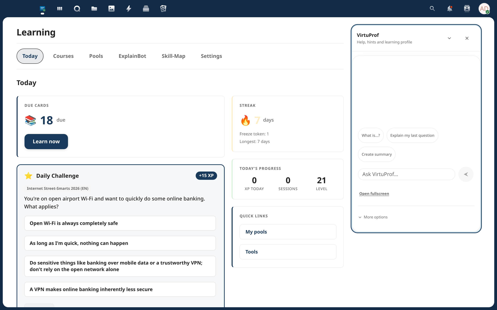
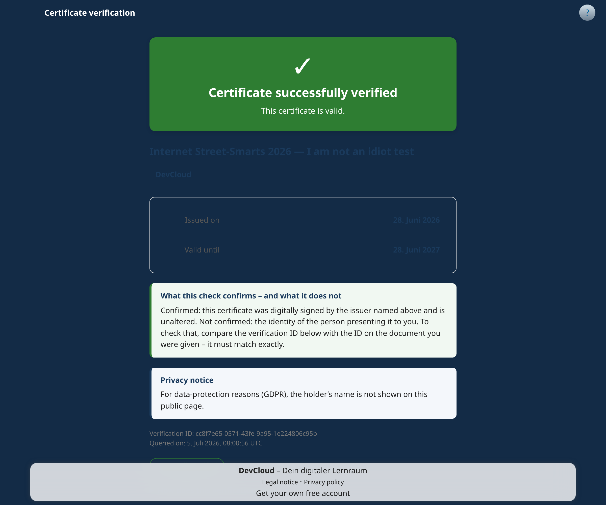
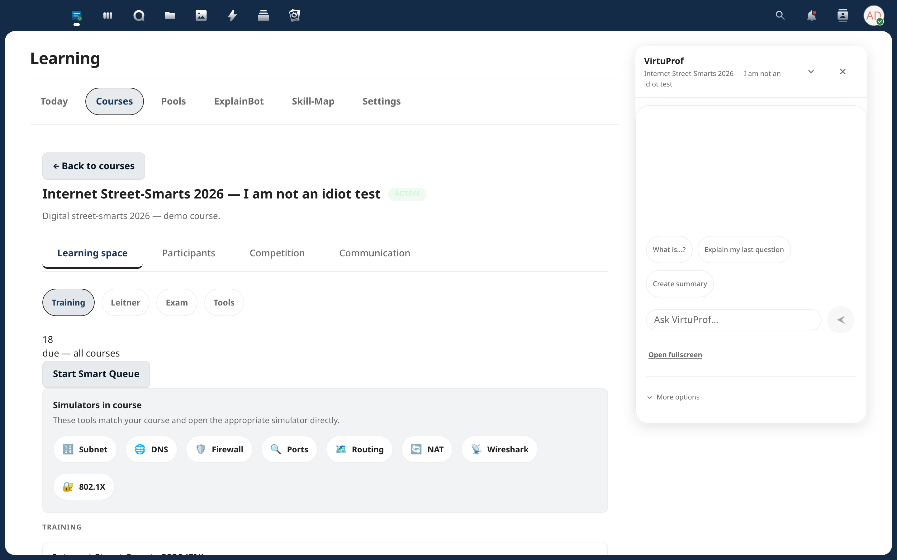

# Learning for Nextcloud

```
    +-------+   +-------+   +-------+   +-------+   +-------+
    |   1   |   |   2   |   |   3   |   |   4   |   |   5   |
    | ||||| |   |  |||  |   |   ||  |   |   |   |   |       |
    +-------+   +-------+   +-------+   +-------+   +-------+
     new and     getting     settling   nearly     mastered
     missed      there                  there

    A card you know moves one box up. A card you miss goes back to
    box 1. The app does the counting. The server is yours.
```

A learning platform that runs inside your own Nextcloud: flashcards with spaced repetition (Leitner boxes or FSRS-5), timed exam simulation, nine interactive IT simulators, story campaigns built from real incidents, and completion certificates signed with Ed25519 that anyone can verify from a URL. Questions, progress and student data stay on your server. AI help is optional and stays off until an admin connects a recipient and each learner has consented.

Made by [André Stiebitz](https://souverain-systems.de), who runs Stiebitz Souverain Systems UG, a small IT company in Potsdam for teams that want to own their data, and teaches IT security. The app began as his own exam preparation for IT certifications and grew with the course groups that used it on his Nextcloud; the simulators, exam presets and certificates are what those courses needed and what hosted platforms only offer in exchange for the data. Written with AI, used in real courses, checked by 1,830 automated tests and pre-push gates (PHPStan, ESLint, Vitest, PHPUnit). What it stands on: [ACKNOWLEDGEMENTS.md](ACKNOWLEDGEMENTS.md).


Built for IT certification bootcamps (CompTIA, Cisco, AWS) but works for any subject, from vocabulary drilling to exam preparation. When a learner passes, the app issues a **cryptographically signed, publicly verifiable completion certificate**, turning any course into a real credential.

> **Looking for pilot partners!** If you run Nextcloud at a school, university, training provider, or public institution — I'd love your feedback. [Open an issue](https://github.com/andremadstop/learning-nc/issues) or email me.



## Documentation

- **[User & Administrator Manual](docs/MANUAL.md)** — the complete workflow end to end:
  course → learning materials → pool → questions → students → test attempt → results →
  completion, plus admin setup, `occ` commands, compliance features and translations.
- [Bulk question import from PDF](docs/import-pool-workflow.md) — get an existing question
  catalogue into the app without typing it.

## Features

### Learning Modes
- **Smart Queue** — one-click review of all due cards, sorted by memory strength (FSRS-5)
- **Leitner System** — classic 5-box spaced repetition with automatic scheduling
- **Training Mode** — quick quiz sessions with immediate feedback and confidence buttons
- **Exam Simulator** — timed exams with configurable presets, passing thresholds, and scaled scoring
- **Story Campaigns** — learn through real IT incident scenarios (WannaCry, SolarWinds, Log4Shell)

### Certification & Compliance
- **Signed completion certificates** — every passing learner automatically receives a cryptographically signed (Ed25519) certificate
- **Public verification portal** — anyone can confirm a certificate's authenticity from its permanent URL, no login required
- **Compliance reports** — organization-wide completion overview for audits and works agreements
- **Mandatory training & recertification** — assign required courses, track certificate expiry, and automate recertification reminders
- **Tamper-proof audit trail** — every issuance, revocation, and completion is logged



### Interactive Simulators (9)
- CLI Terminal, Subnet Calculator, DNS Resolver, Firewall Builder
- Port Scanner, Routing Table, NAT Table, Wireshark Lite, Network Topology Placement



### Multiplayer & Gamification
- **Live Duels** — real-time 1v1 quiz battles via Server-Sent Events
- **Sprint & Elimination** — 2-5 player gameshow modes
- **Seasonal League** — weekly competition with promotion/relegation
- XP, levels, streaks, 10 badges

### For Instructors
- Course management with pool assignment and student enrollment
- **At-risk detection** — automatic warnings for struggling students
- **Chapter heatmaps** — see where the class struggles at a glance
- **Curriculum timeline** — plan course schedule with milestones
- **Admin dashboard** — CSV export, course archiving, cohort merging
- Collaborative knowledge base with student contributions and moderation

### Post-Course Retention
- **Maintenance Mode** — automated long-term review schedule after course ends
- **Trouble-spot cheat sheet** — export your weakest topics for targeted exam prep

### AI Features (optional)
The admin connects either Google Gemini (API key) or a local Ollama server. Without a connection, the app is fully functional — AI features are simply off. Each user must explicitly consent to the recipient the admin configured before any data is sent; the consent is asked again when the consent text or the recipient changes, and can be withdrawn at any time in the personal settings.

- **VirtuProf** — AI learning assistant with RAG-powered answers and source citations
- **Question Generator** — create flashcards from pasted text
- **Note Generator** — AI-powered topic summaries saved to Nextcloud Files

### Question Types
- Multiple Choice (single & multi-select)
- Free Text with fuzzy matching
- Performance-Based Questions (PBQ) — interactive CLI, drag-and-drop, wiring tasks
- CSV/JSON import & export, pool sharing, multi-language translations

## Installation

### From Nextcloud App Store (Recommended)

1. Go to **Apps** in your Nextcloud admin panel
2. Search for **"Learning"**
3. Click **Download and enable**

[View on App Store](https://apps.nextcloud.com/apps/learning)

### Manual Installation

```bash
# The Nextcloud app lives in the repo's app/ subdirectory — clone outside, then copy app/ in.
git clone https://github.com/andremadstop/learning-nc.git /tmp/learning-nc
cd /tmp/learning-nc/app && npm install && npm run build
cp -r /tmp/learning-nc/app /path/to/nextcloud/custom_apps/learning
php /path/to/nextcloud/occ app:enable learning
```

### Certificates setup (one-time)

Signed completion certificates (v5.0.0+) require an issuer signing key. Generate it once
per server — without it, courses can be configured for certification but no certificate is
minted when a learner passes:

```bash
php /path/to/nextcloud/occ learning:cert:init-issuer
```

The admin settings page shows a reminder until the key exists. Rotate later with
`occ learning:cert:init-issuer --rotate` (retired keys keep verifying past certificates).

## Privacy & Data Protection

**No data leaves your server** unless AI features are explicitly enabled by an admin AND the user has given consent.

### When AI is enabled (optional)

| Data sent to the AI recipient | Details |
|---|---|
| Your messages to VirtuProf and other text you enter into AI features | As typed, including what you write yourself |
| Current learning context | The question, the answer options and the explanation |
| Course material excerpts | From the instructors' material; other learners' contributions are **not** sent to an external recipient |
| Information from your learning profile | Goals, motivation, strengths and weaknesses the app recognised |
| Your learning state | For example topics you know well and questions you answered wrongly |
| Summary of your earlier VirtuProf chats | Stored on this server |
| Text and files you turn into questions with AI | Only when you use the question generator |
| Weekly note (automatic) | Once a week your weakest topic and the questions you got wrong there |

**Not sent automatically:** name, email address, account data and passwords. What a learner types into a message is sent as written.

The full list the learner sees (in six languages) is `app/data/ai-consent.json`; the privacy page (`/privacy`) shows the same list with the recipient in force.

### Admin controls
- Global AI switch and recipient (Google Gemini or a local Ollama server) in the admin settings
- Per-user consent, bound to the consent text version **and** the recipient: a changed recipient or a revised text asks again; withdrawal applies to every request that starts afterwards
- Rate limiting: 10 requests/min and 100/day per user, plus a daily limit for the whole instance (default 5000, `ai_global_daily_limit`)
- Audit log of AI requests: time, purpose, recipient, model and token counts — never the content
- Personal data export includes the stored consent and the server-side chat memory (recent messages and replies, summaries of older chats); deleting an account removes them

When AI is enabled, data is processed by the recipient the admin configured. For Google Gemini (USA) review Google's [Data Processing Addendum](https://cloud.google.com/terms/data-processing-addendum); a local Ollama server keeps the data on your own infrastructure.

### Cert lifecycle & compliance (v5.2.0)

**Verify-URL permanence & retention.** Every issued certificate gets a public verify URL. This
URL is *permanent only within the data-retention window*: after `retention_years` (app config,
default **3** — this default is flagged for confirmation with your data-protection officer /
works agreement; statutory duties such as ArbSchG/AGG evidence may require a longer window),
the record is crypto-erased (recipient identity removed, signed credential scrubbed, tombstone
set). From then on the verify URL returns a defined **"record no longer available"** state —
never an error page. Only superseded, closed, or revoked certificates age out; a user's current
active certificate is exempt until it is replaced.

**Works-council prerequisite (Germany).** Recertification reminders and compliance monitoring
are technical monitoring features in the sense of **BetrVG §87 Abs. 1 Nr. 6**. Organizations
with a works council must conclude a **Betriebsvereinbarung** *before* rolling these features
out in production. This is an organizational/legal prerequisite — the app does not and cannot
enforce it. Technically, video-progress tracking uses transient segments (no permanent
fine-grained watch log) as the data-minimizing mitigation.

## Technical

- **Frontend:** Vue 3.5, Vite, Pinia, @nextcloud/vue 9
- **Backend:** PHP 8.1+, Nextcloud App Framework, QBMapper
- **Tests:** 1,830 automated tests (1,329 Vitest, 501 PHPUnit), PHPStan Level 5, ESLint — enforced via pre-push quality gates
- **Real-time:** Server-Sent Events for multiplayer modes
- **Caching:** Redis support for leaderboard and session data

## Requirements

- Nextcloud 33–35
- PHP 8.1+
- PostgreSQL 13+ or MySQL 8+

## Try It

Install it from the [Nextcloud App Store](https://apps.nextcloud.com/apps/learning) on your own instance — Apps → search "Learning". That's also the most informative way to evaluate it: courses, groups, roles and mandatory-training assignments only really show their shape with your own users.

Evaluating it for an organisation? [Open a GitHub issue](https://github.com/andremadstop/learning-nc/issues) with a bit of context — organisation, rough number of learners, timeline — and I'm happy to give you a guided screenshare walkthrough of the instructor and certification views.

## Contributing

Contributions are welcome! Whether it's bug reports, feature ideas, translations, or code — feel free to open an issue or PR.

The interface ships in six languages — German (source), English, French, Russian, Arabic and
Ukrainian. The codebase and documentation are in English.

**None of the translations have been reviewed by a native speaker.** They were produced with
machine assistance from the German source, and that includes English. Corrections are the most
useful contribution there is, and they do not require touching any code — see
[the manual](docs/MANUAL.md#7-languages-and-translations) for how to submit them.

## License

AGPL-3.0 — see [LICENSE](LICENSE)
